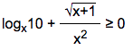

# MathPlus

### About

Transforms math expressions into a beautiful look.

## Getting Started

Insert follow code between ```<head></head>```

```
<script src="mathplus/mathplus.js"></script>
<link rel="stylesheet" href="mathplus/mathplus.css">
```


Insert follow code before closing tag ```</body>```

```
<script src="mathplus/mathplus_use.js"></script> 
```

## How to use

Возведение в степень

```
<mathplus>x^(y)</mathplus>
```

### Example 1

#### Code

```
<mathplus>[block]logx10 + (sqrt(x+1))/(x^2) больше или равно 0[/block]</mathplus>
```

#### Result



## License

This project is licensed under the MIT License - see the [LICENSE.md](LICENSE.md) file for details
